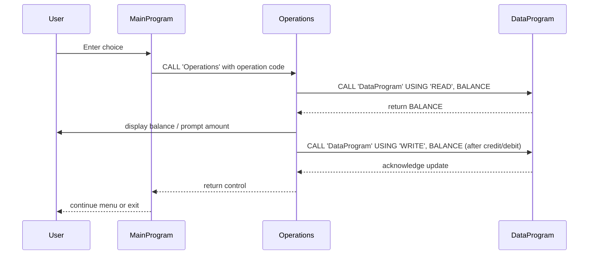

# COBOL Student Account Example

This repository contains a small legacy COBOL application that simulates a simple student account management system. The program demonstrates modular design using multiple COBOL programs that call each other.

## Directory Structure

```
src/cobol/
  data.cob        (Data handling and storage)
  operations.cob  (Business logic for account operations)
  main.cob        (User interface and program flow)
```

## File Descriptions

### `main.cob` - Entry Point / UI

- **Purpose**: Acts as the primary program. Presents a text-based menu to the user for account management options.
- **Key Sections**:
  - `WORKING-STORAGE` defines `USER-CHOICE` and `CONTINUE-FLAG`.
  - `MAIN-LOGIC` loop displays the menu, accepts user input, and dispatches commands.
  - Uses `EVALUATE` to branch on choices and calls `Operations` with operation codes: `'TOTAL '`, `'CREDIT'`, `'DEBIT '`.
  - Option `4` sets `CONTINUE-FLAG` to `'NO'` and exits.

### `operations.cob` - Business Operations

- **Purpose**: Implements the logic for viewing balance, crediting, and debiting the account.
- **Key Data Items**:
  - `OPERATION-TYPE` to capture the requested action.
  - `AMOUNT` for transaction amounts.
  - `FINAL-BALANCE` holds the running account balance (initialized to 1000.00 as default starting value).
- **Logic Flow**:
  - Receives an operation code via `LINKAGE SECTION` parameter.
  - For `'TOTAL '` reads balance from `DataProgram` and displays it.
  - For `'CREDIT'` prompts user for amount, reads current balance, adds amount, writes back, and displays new balance.
  - For `'DEBIT '` prompts user for amount, ensures sufficient funds, subtracts amount if allowed, writes result, or shows an insufficient funds message.

### `data.cob` - Data Storage

- **Purpose**: Acts as the storage layer for the account balance. It holds the balance in working-storage to simulate a database or file.
- **Key Items**:
  - `STORAGE-BALANCE` keeps the persistent balance across calls (initial value `1000.00`).
  - `OPERATION-TYPE` to differentiate between read and write commands.
- **Operations**:
  - If called with `'READ'`, moves `STORAGE-BALANCE` into the passed `BALANCE` variable.
  - If called with `'WRITE'`, updates `STORAGE-BALANCE` from the passed-in `BALANCE`.

## Business Rules for Student Accounts

1. **Initial Balance**: Accounts start with a default balance of $1,000.00.
2. **View Balance**: Users may view the current balance at any time. This simply reads the stored balance without modification.
3. **Credit Account**: Users can add funds by entering a positive amount. The amount is added to the current balance and stored.
4. **Debit Account**: Users may withdraw funds only if the current balance is greater than or equal to the requested amount. If insufficient, the transaction is declined with a message.
5. **Input Validation**: The menu accepts choices `1-4`; any other input triggers an error message and re-displays the menu.

## Notes

- The example is simplified and uses in-memory storage; no actual files or databases are involved.
- COBOL `CALL` statements illustrate modularization typical in legacy systems.

---

This README serves as documentation for developers modernizing or studying the codebase. It outlines each source file, its responsibilities, and the simple rules governing account transactions.

## Sequence Diagram

Below is a sequence diagram illustrating the data flow through the application:


